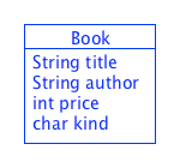

# Lecture 1 - Data Definitions in Java
CSC 121 - Object Oriented Program Design
Nadeem Abdul Hamid - Fall 2024

<!-- paginate: skip -->
<!-- _class: lead -->


---
## Objectives
<style scoped>ul  { font-size: 80%; }</style>

At the end of this lecture you should
- KNOW:
    - How to represent a data definition in Java
    - How to draw a class diagram
    - That no matter how data is represented across different programming languages, the information itself is the same, and thus the structure of the data representation is the same

- BE ABLE TO:
    - Draw a class diagram for a simple Java class
    - Write a data definition for a simple Java class

<!-- paginate: true -->
<!-- footer: Lecture 1 - Data Definitions in Java -->


---
## Information and Data

- Information is everywhere
- Computers do not work with *information*
    - They work with *data* : a *representation* of information relevant & suitable for *computation*

```
121  
one-hundred-twenty-one
1111001
CXXI
0x79
```


---
## Primitive Forms of Data (HtDC §1 (section 1))
<style scoped>ul { font-size: 85%; }</style>

- Java provides several built-it, atomic forms of data to represent primitive forms of information
    - `int`: (exact) whole numbers between -2147483648 to 2147483647
    - `double`: (inexact) decimal numbers (approx. real numbers)
    - `boolean`: true/false
    - `String`: symbolic/character information (sequence of characters between double-quotes `"..."`)
        - Note that, technically, <code>String</code> is not a primitive type, but we will treat it as such for now. (and it is not atomic) 
    - `char`: single character symbols (written between ' ' )

Try: [JavaData.java](../code/JavaData.java)

---
## Compound Data : Classes (§2)

In  Java, if you want a kind of data that isn’t something simple like a number, string, or boolean, you create a ***class***.

Classes let you specify *compound data*, which is data that has different components (such as a phone contact having both a name and a phone number).

---
## Classes: Example

Given the following Racket data definition

```
;; A Book is (make-book String String Num Symbol)
;; There are three kinds of books: fiction, nonfiction, or
;;                                 textbook, represented by symbols 'F 'N 'T
(define-struct book (title author price kind))

;; Examples of books
(define oms (make-book "Old Man and the Sea" "EH" 10 'F))
(define eos (make-book "Elements of Style" "EBW" 20 'N))
(define htdp (make-book "HtDP" "MF" 60 'T))
```


---
## Defining Classes in Java
<style scoped>ul { font-size: 82%; line-height: 120%; }</style>

- Step 1: Set up the class definition:
    - Keyword <code>class</code>, followed by the name (of the structure), followed by <code>{ … }</code>
- Step 2: Declare the fields and their types
    - List each field name, preceded by its type. (Java checks for consistency of types to identify code errors before you run your program.)
    - These "field declarations" should be the first lines inside the body { … } of the class definition.
    - Note: In Java, each statement other than a class definition (and other multiline constructs) ends in a semicolon
- Step 3: Add a constructor
    - Unlike BSL/ISL/ASL in Racket, you have to provide your own “constructor” for your Java class
    - Constructor has **exactly** the same name as the class
    - The parameters to the constructor (for now) look exactly like the field declarations, except the names are separated by commas instead of semicolons.  
    - The body of the constructor contains *initialization statements* for each field in <code>this</code> object


---
- Should be saved in a file named: **Book.java**.

```
/* Represents a book in a bookstore */
class Book {
  String title;
  String author;
  int price;        // whole dollars
  char kind;
  
  Book(String title, String author, int price, char kind) {
    this.title = title;
    this.author = author;
    this.price = price;
    this.kind = kind;
  }
}
```


---
<style scoped>blockquote { font-size: 70%; line-height: 120%; }</style>

## Auto-generating constructors

- For the beginning of this course, our constructors will be "boilerplate"
- Use Eclipse's `Source` menu -> `Generate constructor using fields...` tool to generate the constructor
- For now, ignore `public` annotations added by Eclipse to the class and/or constructor (or choose the `package` access modifier)

> *boilerplate*: code required/reused in many applications with little to no change (i.e. following a fixed pattern) that contributes nothing special to the logic of the application.

---
## Naming Conventions in Java

- **Class** names start with uppercase letter.
    - Class name should match the file name exactly with a ".java" extension

- **Field**, **parameter**, **variable** names start with lowercase letter.

- Use <code>camelCase</code> for multi-word names, use <code>isBlahBlah</code> as a convention for Boolean fields
    - Java has more restrictions on identifiers than Racket: Letters, numbers, underscore (no question mark ? or hyphen - allowed)


---
## Comments in Java

- Single-line comments (like <code>;</code> in Racket *SLs (student languages))
    ```
    // … comment …
    ```

- Multi-line comments
    ```
    /* 
        … comments …
        … comments …
	*/
    ```


---
## Comments: Implementation vs Documentation

- **Implementation comments**: comments about internal details, for temporarily commented out code, or personal developer use

- **Documentation comments**: describe the specification and purpose of code, from an implementation-free perspective, for developers who might not have or be looking at the code itself


Use [**JavaDoc**](https://www.oracle.com/technical-resources/articles/java/javadoc-tool.html) comments  `/**   ...  */`  (two asterisks at the beginning) for documentation


---
## Examples of Data

```
new Book("HtDP", "MF", 60, 'T')
```

is the same as

```
(make-book "HtDP" "MF" 60 'T)
```

- The <code>new</code> keyword used before the class name in Java specifies the same action as a *"**make**-structure-name"* statement in Racket.


---
## Terminology

```
new Book("HtDP", "MF", 60, 'T')
```

Application of the constructor creates an **INSTANCE** (or **OBJECT**) of the Book class – i.e. a piece of data representing a concrete example from the collection of all books


---
## Examples of Data (Java)

All examples should be grouped in a single, separate "...Test" class

```
class BookTest {
  Book oms = new Book("Old Man and the Sea", "EH", 10, 'F');
  Book eos = new Book("Elements of Style", "EBW", 20, 'N');
  Book htdp = new Book("HtDP", "MF", 60, 'T');
}
```

- Eclipse can create & name this class if you right-click on the "Book.java" and choose "New -> JUnit test case". (ignore the `@Test` stub with `fail`ing test for now)


---
```
Book eos = new Book("Elements of Style", "EBW", 20, 'N');
```

<style scoped>ul { font-size: 85%; }</style>

- To create an instance of your class you need to use the keyword <code>new</code> before you call your class's constructor. 
    - Instances of classes are called 'objects'. 
- To call a constructor you need to provide the name of the constructor, e.g. <code>Book</code>, and the arguments to the constructor in a comma-separated list inside parens, e.g. <code>(“Elements of Style”, “EBW”, 20, ‘N’)</code>. 
- To name an object so that you can refer to it later you need to provide the class name and then the name you want to use, i.e. <code>Book eos</code> followed by an equal sign '='. 
    - You can think of this as saying that the name <code>eos</code> can be used to refer only to objects created by the class <code>Book</code> and I want it to refer to the particular instance that has “Elements of Style” as the title, etc.


---
## Class Diagrams



- Class diagrams are a pictorial tool for representing the structure of class definitions.
- Generally, you will make a class diagram ***before*** you write the actual class 
    - Class diagrams help you think about the data 
    - Are a crucial part of the data design and analysis.

The upper portion of the class diagram holds the class name and the lower portion holds the fields and field type names.


---
## Class Diagrams
<style scoped>ul  { font-size: 85%; }</style>


- A way of representing the text (comments) part of the data definition in CSC120 data definitions.
    
- Can be used for Racket as well, but is very useful in class-based languages like Java, where the code for the actual data definition can become quite verbose.

- **UMLet**
    - Online: https://www.umletino.com/umletino.html
    - Download standalone app: https://www.umlet.com/ 
    - Eclipse plugin (it is sometimes unstable and crashes): "Help" menu -> "Eclipse Marketplace...": search for "UMLet - UML Tool for Fast UML Diagrams"

Example: [book.uxf](../code/book.uxf)

---
## Summary

- In Java, we don’t define “struct”s to describe compound data; we define **classes**. 
    - Throughout the course, we’ll see the ways classes differ from structs in how they let us organize our code, and the abstraction mechanisms they provide. 
- A visual way to describe these structure definitions and their relationships is with a **class diagram**.
    - Data definitions in Racket translate into class diagrams in Java, arrows and all.*


---
`*` **secret**: the class diagrams we learn are really standard [UML](https://www.uml.org/) -- the de-facto standard for building object-oriented software. 
> *The Unified Modeling Language (UML) is a graphical language for visualizing, specifying, constructing, and documenting the artifacts of a software-intensive system. The UML offers a standard way to write a system's blueprints, including conceptual things such as business processes and system functions as well as concrete things such as programming language statements, database schemas, and reusable software components.*

<div style="font-size: 50%; text-align: right;"> OMG Unified Modeling Language Specification. OMG, 2007. www.omg.org.</div>


---
## Credits

Material in course slides is adapted from:
- Jenny Walter, Vasser College
- Viera Proulx et al., Northeastern University
    https://course.ccs.neu.edu/cs2510/index.html
- Kathi Fisler, Glynis Hamel et al., Worcester Polytechnic Institute
    https://web.cs.wpi.edu/~cs2102/d17/Lectures/migrate.html
