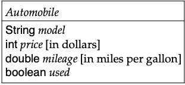

# Homework 1 - Simple Data Definitions in Java

- Generally speaking, you will code all your homework assignments in Eclipse.
- **Create a separate** "Java Project" in your Eclipse workspace for each assignment (name them as specified at the top of each assignment). 
- **To submit an assignment**, right-click on the "src" folder of the project; choose "Show In --> System Explorer". This should open up to the "src' directory/folder in Windows File Explorer/Mac OS Finder. Go into the "src", select all the relevant Java files and upload/copy them to your shared submission directory. *Please do not copy the `src` folder itself* to your submission directory -- select and copy the files *inside* the Eclipse `src` folder.

> For this assignment, create a project named `hw01-simple-classes` in Eclipse.

## Tasks

1. Translate the class diagram below into a class definition. Create instances of the class as examples.

    

---
2. Develop a class that captures *students*. Each student has a first name, last name, class year, and major. Create at least two examples of students.

---
3. Develop a class that captures *planets*. Each planet has a **name**, a **distance** from the sun, and its **gravity** relative to Earth’s gravity. For distance and gravity, use the type `double` which captures real numbers. As examples, make instances for `Earth` and your favorite non-earth planet.

---
4. Consider the following context:

    > . . . Develop a program that creates a gallery from image descriptions that specify the height, width, and name of a source file, plus some additional information about their quality. . . .

    Critique the following class definition. Copy the code into your Eclipse workspace and make any modifications. Put a block comment at the bottom of the file listing what you modified and why.

    ```
    // represents a computer image file
    class Image {
        int height;
        int width;
        String source;
        String quality;
        
        Image(double width, double height, String quality) {
            this.height = height;
            this.width = width;
            this.quality = quality;
        }
    }
    ```

---
5. Design a data representation (name your class `Rational`) for rational numbers that will support addition, subtraction, multiplication, and division. A rational number has a **numerator** and a **denominator**.

    Don't forget a `Test` class with a *good variety* of examples.


## Rubric

- Correct Java syntax: compiles & runs
- Includes specified fields, commented if appropriate
- Provides a boilerplate constructor definition
- Provides a representation comment (in `/** JavaDoc notation */`) for the class
- Defines a `...Test` class for each task
- Defines at least 2-3 *representative* examples
- Code style (indentation, spacing, class & field names, capitalization conventions)

