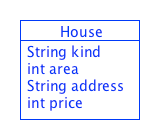
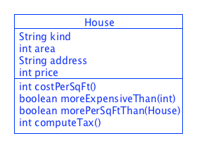

# Lecture 2 - Methods; Expressions; Conditionals
CSC 121 - Object Oriented Program Design
Nadeem Abdul Hamid - Fall 2024

<!-- paginate: skip -->
<!-- _class: lead -->


---
## Objectives
<style scoped>ul  { font-size: 92%; }</style>

At the end of this lecture you should
- KNOW:
    - That a method is invoked by an object of the class in which the method is defined.
    - That `if`/`else` statements are used in Java to implement conditional behavior

- BE ABLE TO:
    - Construct Java expressions using primitive operators and method calls
    - Define a method for a simple class

<!-- paginate: true -->
<!-- footer: Lecture 2 - Methods, expressions, conditionals -->


---
## Computing with Primitive Types
<style scoped>ul { font-size: 85%; }</style>

- Operations for primitive types (numbers and booleans)
    - Arithmetic operators:   `+  *  /   -`
    - Logical operators:  `&&` (and)  `||` (or)  `!` (not)
    - Relational operators:  `<   <=  >  >=  ==  !=`
        - See Figure 36 (pg 86, HtDC)

- Written using *infix* notation (like math):
    ```
	...  10 * 12.50  ...
    ...  width + height ....
    ...  (0 < x)  &&  (x < 10) ...
    ...  (10 + 2) * Math.PI  ...
    ```
    - Note, parentheses used to overrule precedence 


---
## Computing with Strings

`String`s are not really primitive types – they are instances of the `String` class

- To understand how to process strings, or instances of classes in general, we need to understand ***method calls***. 


---
## Method Calls
<style scoped>ul { font-size: 90%; }</style>

- A ***method*** is somewhat like a *function* in Racket
    - Consumes (input) data and produces a result (output)
- However:
    - Methods are always associated with a `class` (not independently defined, like functions)
    - When a method is *called* ("applied"/"used") it always receives at least one argument (parameter) – an instance of the class with which the method is associated
    - We call it the method’s primary argument
    - Terminology: in Racket we *apply* functions to arguments (parameters); in Java we ***invoke*** a method on an object/instance.


---
## Method Calls: Example (1)
<style scoped>ul { font-size: 70%; }</style>

In Racket:
```
        (string-length “CS is fun”)
```

In Java:
```
        “CS is fun”.length()
```

- Object comes first...
- then a dot...
- then name of the method.
- Additional arguments may be provided in parentheses


---
<style scoped>ul, p { font-size: 90%; }</style>
## Method Calls: Example (2)

- In Racket: ```(string-append “Hello” “World”)```

- In Java: ```“Hello”.concat(“World”)```

    - Java happens to provide a shortcut operator for the `concat` method on strings: `“Hello” + “World”`) 

- Java: ```“Hello”.concat(“World”).length()```
  - (Racket: `(string-length (string-append "Hello" "World"))`)
  - Note: the first parameter becomes the object to which the method is applied

Methods for `String`: Figure 37, page 88, HtDC (or see Java API docs)


---
## Method Calls: Summary

```eObject . methodName( exp, ... )```

Where

- `eObject` is an expression that evaluates (simplifies/reduces) to an *object*
- `methodName` is defined in the *class* of which the object is an instance
- `exp, ...` are arguments for any additional parameters in the method definition


---
## Defining Methods in Classes

> *... Develop a "real estate assistant" program.  The "assistant" helps real estate agents locate available houses for clients. The information about a house includes its kind, the square footage, its address, and  the asking price. An address consists of a street number and a street name.*

~

<div style="float: right; width: 75%; font-size: 70%;">
Examples:<br>
1. Ranch, 2500 sq ft, 23 Maple St., $375,000 <br>
2. Colonial,2000 sq ft, 18 Thelberg Rd., $250,000 <br>
3. Cape, 4000 sq ft, 12 Timberline Dr., $400,000 
</div>




---
## House (1)


```
/** Represents information about a house for sale */
class House {
    String kind;
    int area;     // in square feet
    String address;
    int price;    // in dollars

    House(String kind, int area, String address, int price) {  // boilerplate constructor
        this.kind = kind;
        this.area = area;
        this.address = address;
        this.price = price;
    } 
}
...
House ranch = new House("Ranch", 2500, "25 Maple St", 375000);
House colon = new House("Colonial", 2000, "18 Thelberg Rd", 250000);
House cape = new House("Cape", 4000, "12 Timberline Dr", 400000);

```


---
## A First Method

> *Design a method called `costPerSqFt` that computes the price per square foot of a given house*

- We follow the Design Recipe (**DR**):

    - Write down a signature, purpose comment, and stub for the method
        - In Java, the signature is actual code (not a comment, like in Racket/Python). It is called the **method signature**.


--- 
## Signature, Purpose, Stub
<style scoped>ul { font-size: 80%; }</style>

Goes inside the `House` class (somewhere below the constructor)

```
  /** to compute the cost per sq foot of this house  
      (in dollars) */
  int costPerSqFt() { return 0; }
```


- The signature assumes that `costPerSqFt` consumes a `House` object as an *implicit parameter*, which has a standard name in the context of the method: `this`. 
    - We never have to include the implicit `this` parameter in the list of a method’s parameters.
- We describe the purpose in terms of `this` object.
- The result produced by the method is an `int`.
  - Use a `return` statement to produce any value of the correct result type.


---
<style scoped>ul, p { font-size: 90%; }</style>
## Examples/Unit Tests
<small>*(DIFFERENT SYNTAX THAN WHAT IS IN THE TEXTBOOK)*</small>

- We add examples to our `HouseTest` class, formulated using `assertEquals` method calls
    - Each set of examples/unit tests for a method should go in its own method named `testMethodName` in the Test class, with an `@Test` annotation on the line before.

    ```
      @Test
	  void testCostPerSqFt() {
	    assertEquals(150, this.ranch.costPerSqFt());
	    assertEquals(125, this.colon.costPerSqFt());
	    assertEquals(100, this.cape.costPerSqFt());
	  }
    ```


---
## Formulate a Template

Recall from CSC120: the template for a function that consumes a structure has selector expressions for each field of the structure

```
(define (house-func a-house ...)
   ( ... (house-kind  a-house) ...
     ... (house-area  a-house) ...
     ... (house-address a-house) ...
     ... (house-price a-house) ... ))
```


---
## Template in Java
<style scoped>ul { font-size: 90%; }</style>

- Each instance of the `House` class consists of four pieces of data: `kind`, `area`, `address`, `price`
- In Java, we access ("select") an object's fields using dot notation:     ```object . field```
    - Template is made up of expressions to access fields of `this` object:

```
  int costPerSqFt() {
    ... this.kind ...        -- String
    ... this.area ...        -- int
    ... this.address ...     -- String
    ... this.price ...       -- int
  }
```


---
## Method Body

- Use pieces of the template to define the method:

```
    /** to compute the cost per sq foot of this house (in dollars) */
    int costPerSqFt() {
        return this.price / this.area;
    }
```

- The explicit `return` keyword tells what will be produced as the result of a method call


---
## Test!

- Open the "Test" class file and make sure it is the active editor window in Eclipse.
- Click the "Run" button on the Eclipse toolbar.

Test failures may result in a (very very) long list of error messages – usually only the first few lines are relevant to debugging: they provide the expected/actual results, and the file & line number of the failed test


---
## Template

- We know from CSC120 the value of templates, so:
    - After the constructor of every class from now on, write, as a comment, a template to use when defining methods in the class
    
- Initially, the template only contains field selector expressions
    - Annotate with types

- **Every time a new method is defined in the class, add it to the template...**


---
## Template for House methods

```
	/* TEMPLATE
  ??? houseMethod(...) {
    ... this.kind ...        -- String
    ... this.area ...        -- int
    ... this.address ...     -- String
    ... this.price ...       -- int

    ... this.costPerSqFt()   -- int
  }
```

You can *copy/paste* this template every time you need to define a new method; or at least *refer to it* when figuring out the definition of a method 


---
## Class Diagrams with Methods

We add a third section to our class diagrams, listing methods of the class along with their return type and parameter types




---
## Conditionals in Java

In Java, conditionals are written using `if`/`else` statements:

```
if ( boolean-condition ) {
  statement1
} else {
  statement2 
}
```

Statements are either a `return` statement, or another `if`/`else` statement.


---
## Conditionals: More than two cases

```
    if (this.kind == 'F') {
      return this.price - 3 * (this.price / 10);
    } else  if (this.kind == 'N') {
      return this.price - 2 * (this.price / 10);
    } else {
      return this.price;
    }
```

- Notice grouping of the brackets `{ … }`
    - Keep your indentation nice: "Source" -> "Correct indentation" – if it doesn’t indent as expected, check your brackets


---
## Reading

- Optional, but Helpful
    - Each section of HtDC works through carefully selected examples – you should follow them through; ideally, you should type up the class definitions yourself as you read along – then you can run the files yourself at the end.
    - In any case, source code for some of the book's examples will be posted on the Github repo.
    - Remember, we use different syntax than the book for checkExpect tests.


---
## Code examples for this lecture

In the Github repo [code for this lecture](../code/):
    - `House`
    - `Book`

- Note about `assertEquals`: unlike, `check-expect`, Java does not compare user-defined objects (compound data) for "equality" based on the contents of their fields
  - Have to define "equality" -- we will see how later
  - Meantime, use `toString` method to compare object contents