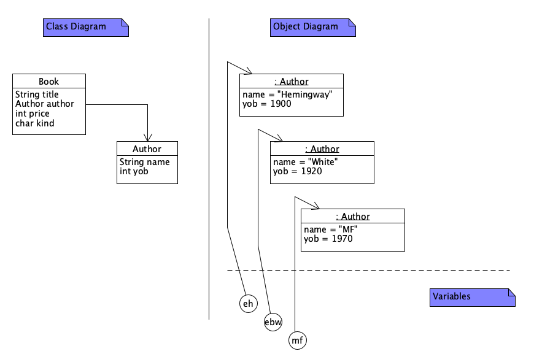
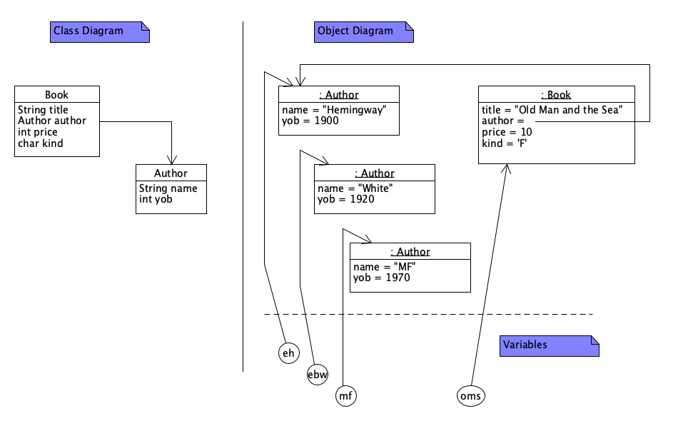
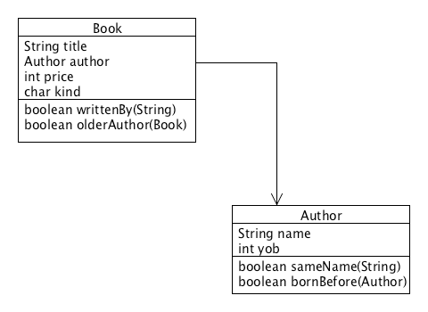

# Lecture 3 - Object Containment, Methods, and Diagrams
CSC 121 - Object Oriented Program Design
Nadeem Abdul Hamid - Fall 2024

<!-- paginate: skip -->
<!-- _class: lead -->


---
## Objectives
<style scoped>ul  { font-size: 85%; }</style>

At the end of this lecture you should
- KNOW:
  - That the Design Recipe we developed in CSC120 can be used to design Java classes and methods
  - That the program designer needs to think very carefully about which class should define a method that may involve instances of more than one class
  - That an *Object Diagram* shows the interaction between objects at some point during the run time of the program

- BE ABLE TO:
    - Design and define methods for simple classes and compound classes
    - Draw a diagram of classes and objects at a particular point in a given program


<!-- paginate: true -->
<!-- footer: Lecture 3 - Object Containment, Methods, and Diagrams -->


---
## Review: Design Recipe for Basic Classes and Methods
<style scoped>ul { font-size: 85%; line-height: 1em; }</style>

- Problem analysis: data definitions (class diagrams) and class/interface definitions

- Formulate a purpose statement, method stub (signature)
- Write examples using `assertEquals` in a unit test class
- Lay out an inventory in a template:
  - For basic classes, template consists of the main argument’s (`this`) fields and methods as well as fields and methods of other arguments
- Define the method body, using the pieces of the template
- Run the examples as tests


---
## Containment: Books and Authors

```
;; represents a book in a bookstore
;; A Book is (make-book String Author Number)
(define-struct book (title author price))
 
;; represents an author of a book (with the year of birth)
;; An Author is (make-author String Number)
(define-struct author (name yob))


;; Examples:
(define pat (make-author "Pat Conroy" 1948))
(define beaches (make-book "Beaches" pat 20))
```


---
## Class Diagram: Books and Authors

Instances of the `Book` class refer to (i.e. ‘contain’) instances of the `Author` class


Setup: [Book.java](../code/BookstoreStubs.java) and [BookTest.java](../code/BookTest.java)


---
## Class Definitions

```
/** to represent a book in a bookstore */
class Book {
    String title;
    Author author;
    int price;
    char kind;

    Book(String title, Author author, int price, char kind){        Author eh = new Author("Hemingway", 1900);
        this.title = title;                                         Author ebw = new Author("White", 1920);
        this.author = author;                                       Author mf = new Author("MF", 1970);
        this.price = price;
        this.kind = kind;                                           Book oms = new Book("Old Man and the Sea", this.eh, 10, 'F');
    }                                                               Book eos = new Book("Elements of Style", this.ebw, 20, 'N');
}                                                                   Book htdp = new Book("HtDP", this.mf, 60, 'T');

/** to represent a book author */
class Author{
    String name;
    int yob;

    Author(String name, int yob){
        this.name = name;
        this.yob = yob;
    }
}
```


---
## Object Diagrams vs. Class Diagrams

- A class diagram represents an abstract model consisting of classes and their relationships
  - captures the structure of the program code
  - exists independently of program execution (static view of code)

- An ***object diagram*** represents *instances of classes* (i.e. objects) in memory at a particular moment
  - represents a snapshot of a program in execution (dynamic)
  - only makes sense in the context of a particular location in the code


---
## Object Diagram Example
```
    Author eh = new Author("Hemingway", 1900);
    Author ebw = new Author("White", 1920);
    Author mf = new Author("MF", 1970);
       // ----  draw an OBJECT DIAGRAM of the state of the program here (A)

    Book oms = new Book("Old Man and the Sea", this.eh, 10, 'F');
       // ----  draw an OBJECT DIAGRAM of the state of the program here (B)
    Book eos = new Book("Elements of Style", this.ebw, 20, 'N');
    Book htdp = new Book("HtDP", this.mf, 60, 'T');
```


---
Object Diagram - Point (A)



---
Object Diagram - Point (B)



---
## Book: Adding a Method and Examples

```
    /** was this book written by the given author? */
    public boolean writtenBy(String author){
        return false;
    } 
```
```
assertEquals(true,  oms.writtenBy("Hemingway"));
assertEquals(false, eos.writtenBy("Hemingway"));
assertEquals(false, htdp.writtenBy("White"));

```


---
## Filling in the method

```
    public boolean writtenBy(String author){
      ... this.title ...          -- String
      ... this.author ...         -- Author   <================
      ... this.price ...          -- int
      ... this.kind ...           -- char

      ... author ...                          <================
    } 
```
To complete the `writtenBy` method, we probably need to work with the `Author` contained in this `Book`. That is, we need a method to tell if *this* book's author’s name matches the given `author` parameter.


---
## Adding a Method to Author

Seems reasonable that we should be able to ask an `Author` object if its name matches a given `String`...

```
    /** is this author's name the same as the given name? */
    public boolean sameName(String name){
        return false;
    }
```
```
assertEquals(true,  eh.sameName("Hemingway"));
assertEquals(false, ebw.sameName("Hemingway")); 
assertEquals(true,  mf.sameName("MF"));
```


---
## Adding to the Book template
<style scoped>code { font-size: 60%; }</style>

```
    public boolean writtenBy(String author){
      ... this.title ...          -- String
      ... this.author ...         -- Author           <================
      ... this.price ...          -- int
      ... this.kind ...           -- char

      ... this.author.sameName(String) -- boolean     <================

      ... author ...
    } 
```

In general:
```
    ... this.author.authorMethod(...) ...
```


---
## Finish Up...

- Bookstore.java
- BookTest.java



---
## Summary: Methods for classes that contain classes
<style scoped>ul { font-size: 85%; line-height: 1em; } h2 { font-size: 120%; }</style>

- Formulate stub, purpose statement
- Write functional examples, using data  examples in the Test class
- Create the template:
  - fields of `this` object
  - methods of `this` object
  - schematic method call on fields that refer to another class in the diagram
- Define the method
  - If the computation needs data contained in another class, formulate a method header and purpose statement for that and place the method on "wish list"
- Continue steps above for every method on the *wish list*
- Test by running the examples
  - If errors, focus first on fixing methods in classes that don’t refer to others via containment arrows. Then fix the containing classes.


---
## Code examples for this lecture

In the Github repo [code for this lecture](../code/):
- [Bookstore.java](../code/Bookstore.java)
- [BookTest.java](../code/BookTest.java)
