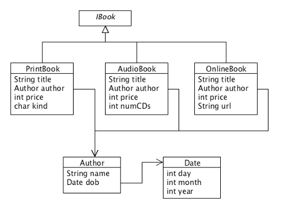

# Lecture 4 - Unions; Interfaces; Hierarchies
CSC 121 - Object Oriented Program Design
Nadeem Abdul Hamid - Fall 2024

<!-- paginate: skip -->
<!-- _class: lead -->


---
## Objectives
<style scoped>ul  { font-size: 85%; }</style>

At the end of this lecture you should
- KNOW:
    - That an `interface` is the way to represent the ***union*** of classes (mixed data) in Java

- BE ABLE TO:
    - Draw a class diagram for a compound class
    - Write a data definition for a compound Java class
    - Draw a class diagram for an interface
    - Define a Java interface


<!-- paginate: true -->
<!-- footer: Lecture 4 - Containment and Unions -->


---
## Review: Containment

- A class in Java is somewhat like a structure in Racket
    - Each instance (object) of a class *compounds* several pieces of data into one
- Remember, this compounding can happen at several levels – a piece of information consists of many pieces of other information, which consist of further pieces, etc.


---
## Example: Books and Authors

- Imagine that we would like more information about the author, such as the year of birth.
    - It is clear that the information about the author should not be defined together with book objects, as there may be several books written by the same author.
- What issue(s) would arise if we defined information about a book and author in one single class?


---
## Class Diagram: Books and Authors

- Notice the **containment arrow**: indicates that a `Book` contains a reference to an `Author`.


---
## Multiple Levels of Containment

- Represent authors' complete date of birth...


---
## Textbook Scenario (page 23)

> ... Develop a program that can assist railway travelers with the arrangement of train trips. The available information about a specific *train* includes its schedule, its route, and whether it is local. (The opposite is an express train.) The *route* information consists of the origin and destination station. A *schedule* specifies the departure and the arrival *time*. ...


---
## Train Schedule – Class Diagram

- Draw one!

- (Use UMLet)

(Solution in repo)


---
# Unions of Classes
<style scoped>li { font-size: 90%; } code  { font-size: 50%; }</style>

- *Our book store expands with online content and audio books. For audio books we track the number of CDs; for online works, we store the URL.*
    - Mixed Data/Itemization (***union*** of three classes of books):


```
;; A Book is one of
;;    -- PrintBook
;;    -- AudioBook
;;    -- OnlineBook
  
;; A PrintBook is (make-print-book String String Num)
(define-struct print-book (title author price))

;; An AudioBook is (make-audio-book String String Num Num)
(define-struct audio-book (title author price no-cds))

;; An OnlineBook is (make-online-book String String Num String)
(define-struct online-book (title author price url))
```


---
## Interfaces

- **Interface** = special kind of *data type* in Java, used to represent a union (itemization) of variant classes
    - Doesn’t contribute any objects to the collection of objects
    - Just serves as a representation for the complete collection of objects
- *Relationship* between an interface and specific classes is called one of **INHERITANCE**
    - Indicated in class diagram by solid-head arrows


---
## Books – Class Diagram (i)

- By convention, we start names of interfaces with (capital letter) I


[Java code](../code/Books_i.java)


---
## Books – Class Diagram (ii)

- Note two different kinds of arrows: containment (“has-a” - open head) vs. inheritance (“is-a” - solid head)




---
## Class/Interface Definitions

- Interface definitions use keyword `interface` instead of `class`
    - Body `{ … }` of the interface is completely empty for now
- Inheritance relationship between a class and interface expressed with the keyword `implements` 

```
class PrintBook implements IBook { 
    . . .
}
```

See .....


---
## Types

- Every field is declared with a **TYPE**, consider:

```
IBook htdp = new PrintBook(...);
```

- `htdp` *has type* `IBook` – can refer to any object in the collection of `IBook`s
- `htdp` *is assigned to* a specific instance of `PrintBook` (which “is-an” `IBook`)


---
## Types vs. Classes

- In Java, a type is either 
    - the name of an interface,
    - the name of a class, or    
    - a primitive type. 

- Every class is a type, but not every type is a class   because interfaces and primitive types are types too.


---
## Type Correctness

- If a program contains:

```	
	Ty inst = new Cls(…)
```

- Correct only if
    - `Cls` is the same as `Ty`, or
    - `Cls` *implements* `Ty`.

    - Otherwise, a **TYPE ERROR**.


---
## Summary (i)
<style scoped>li { font-size: 90%; }</style>

- If you have several pieces of information that ought to belong to one collection but they have different *kinds* of attributes or consist of different fields, represent the information as the *union* of distinct classes
    - Draw a diagram with one interface and as many implementing classes as distinct kinds of objects
    - The interface represents the collection of information in its entirety; the implementing classes represent the distinct variants (or subsets) of information
    - Use a inheritance arrow to indicate the relationship between the classes and interface
    - If necessary, add other classes and containment arrows


---
## Summary (ii)

- Given a complete class diagram, translate it into class and interface definitions
    - Include a purpose comment with each class definition

- Make up examples – use the interface to provide a type for all the examples


---
## The Boston T


---
## Exercise 1 – Traveling the T in Boston

> We wish to represent train stations for the Boston subway (the “T”) and for the commuter lines. Each station has a name and the name of the line that serves it.  A subway station also has a price it costs to get on the train. For commuter trains the price depends also on the place of exit, and so we do not need that information. However, a station on the commuter line may be skipped by the express trains we need to know whether this is the case.

---
## Exercise 1 –Traveling the T in Boston

- T-stop examples:
    - Harvard station on the Red line costs $1.25 to enter 
    - Kenmore station on the Green line costs $1.25 to enter 
    - Riverside station on the Green line costs $2.50 to enter 
- Commuter rail examples:
    - Back Bay station on the Framingham line is an express stop 
    - West Newton stop on the Framingham line is not an express stop 
    - Wellesely Hills on the Worcester line is not an express stop


---
## Exercise 1 – Traveling the T in Boston

- Class diagram


---
## Exercise 2 - Animals


---
## Credits

- Material in course slides is adapted from:
    - Jenny Walter, Vasser College
    - Viera Proulx et al., Northeastern University
    - Glynis Hamel, Worcester Polytechnic Institute

