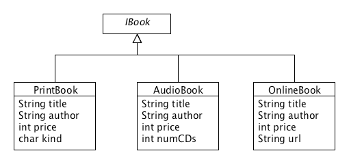

# Lecture 5 - Methods and Unions of Classes
CSC 121 - Object Oriented Program Design
Nadeem Abdul Hamid - Fall 2024

<!-- paginate: skip -->
<!-- _class: lead -->

---
## Objectives

At the end of this lecture you should
- KNOW:
    - that designing methods for unions in a class-based language leverages the fact that the `interface` that represents the union has a meaning in the language
    - that when an instance of a class invokes a method, the method definition lookup is *dispatched* to the class to which the instance belongs
    - that the method dispatch eliminates the need for the conditional we used in Racket to distinguish between variants in a union
    - that the method must be defined as `public`, with the same signature in all classes that implement the interface

- BE ABLE TO:
    - Design and define methods for unions of data in Java

<!-- paginate: true -->
<!-- footer: Lecture 5 - Methods and Unions of Classes -->

---
## Example: A Method for Books

- [Starter code](../code/Books_starter.java)
    - [Test class](../code/BooksTest.java)

---
## Example: Shapes

- [Starter code](../code/Shapes_starter.java)
    - [Test class](../code/ShapesTest.java)

---
## Designing Methods for Unions of Classes

- Formulate a purpose comment and method signature in the `interface`.
- Add a `public` method signature and stub to each implementing class.
- Add examples to the test class; at least one for each variant of the union.
- Lay out the template in each concrete method stub.
- Define the methods.
- Run tests.

--- 
## Reading
- Section 12 – Methods and Unions of Classes
    - "Wish lists" & "Templates"
    - Shapes example worked out

