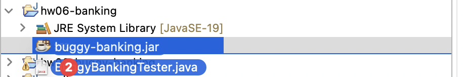
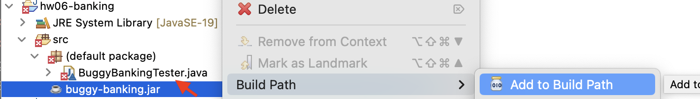

# Homework 6 - More Methods for Unions

Create an Eclipse project named `hw06-banking`.

## Part 1: Bank Accounts

Download this file: [Banking.java](Banking.java) and add it to your project.

 It contains definitions of classes that represent different types of bank accounts. A customer can withdraw all money from a savings account. When withdrawing from a checking account, the minimum balance must remain. The customer cannot withdraw from a CD account if is has not matured.

1. Create a test class with examples of the following accounts.
    - A checking account for Aubrey Smith with id 123, a minimum balance of $50 and current balance of $150.
    - A savings account for Bailey Jones with id 456, a balance of $120 and interest rate of 2.5%.
    - A certificate of deposit account for Pat Malloy with id 334, a balance of $300 that has not yet matured.

Create additional example objects as needed as you develop tests/examples for the following methods.

2. Design the method `amtAvailable` for the classes that represent bank accounts that produces the amount that the customer can withdraw from the account. (Read the comment at the top of the provided file for restrictions on withdrawals.)

3. Design the method `moreAvailable` that determines whether one account has more available for withdrawal than another account. (The method should have a single parameter of type `IAccount` and produce a `boolean`.)

4. Design the method `withdraw` that produces a new account with the given amount withdrawn. If the amount the customer wants to withdraw exceeds the available amount, no money will be withdrawn.

    Use Eclipse to add `equals()` methods to each of the classes, so that your `assertEquals()` test cases work as expected.

    *Note:* Later we will learn how we can signal that the transaction is not valid.

---

## Part 2: Buggy Bank Accounts

***Start working on this, but due by Monday, 9/16***

Download the following two files and add them to your Eclipse project. (When you have downloaded them, you can open your "Downloads" folder and select and drag both files onto the "src" folder in your Eclipse project.)

- [buggy-banking.jar](./buggy-banking.jar)
- [BuggyBankingTester.java](./BuggyBankingTester.java)

*Drag onto the 'src' folder in your project:*

Once they are in your Eclipse project, right-click on the `buggy-banking.jar` file, and from the pop-up menu, choose "Build Path" -> "Add to Build Path". 

### Your Job:

Slop E. Koder developed a union of classes as you did, along with methods `amtAvailable`, `moreAvailable`, and `withdraw`. However, they forgot to develop test cases first, and there are 5 bugs in their code. Your job is to develop test cases (add them to the `BuggyBankingTester.java` file) and try to identify at least 4 of them. For each bug you find, include a comment with your test case explaining what method the bug is in, and as specifically as possible what situation causes the bug.  

All that is available to you are the compiled Java bytecode files bundled up in the `buggy-banking.jar` library that you downloaded and added to your project. The  `BuggyBankingTester.java` refers to Slop E. Koder's banking interface and classes using the `buggy` package prefix, e.g. `buggy.IAccount`, `buggy.Checking`, etc., when declaring types. Make sure to retain this notation on the names of the classes/interface, so that your test cases are running against Koder's code and not yours that you developed in the first part of this assignment.

