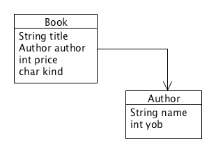

# Lecture 8 - Self-referential data; Overloading constructors
CSC 121 - Object Oriented Program Design
Nadeem Abdul Hamid - Fall 2024

<!-- paginate: skip -->
<!-- _class: lead -->


---
## Objectives
<style scoped>ul  { font-size: 90%; }</style>

At the end of this lecture you should
- KNOW:
    - That the self-referential data definitions we defined in CSC120 translate in a systematic way to class-based data definitions
    - That you can **overload** constructor definitions in Java

- BE ABLE TO:
    - Draw a class diagram for self-referential data (like lists and trees)
    - Define classes to represent self- and mutually-referential data
    - Provide Java examples of data for unions, lists, and trees


<!-- paginate: true -->
<!-- footer: Lecture 8 - Self-referential data; Overloading constructors -->


---
## Bookstore Example

Our bookstore needs to represent, not just a single book, but an arbitrarily large collection of books.

- Recall how we represented lists of data in *HtDP*

    

    [bookstore code](../../class03-containment/code/Bookstore.java)


---
## List of Books

A list of books is a union of classes

```
;; A List-of-Books is either:   <--------\
;;   - empty, or                         |  self-referential arrow 
;;   - (cons Book List-of-Books)     ----/
```

- Two distinct sub-classes: 
    - the class of the empty list
    - the class of ‘cons’ed lists

- We define a union `ILoB` of two variant classes: `MTLoB` and `ConsLoB`


---
## List of Books – Class Diagram


---
## A Full Class Hierarchy


---
## Example: Family Trees

- Develop a data definition to represent an “ancestor tree” – a tree representing information about people’s ancestors; keep track of name and eye color (Strings) for each person

- Draw a [graphical example](https://progenygenealogy.com/products/family-tree-charts/sample-charts/ancestors/)…


---
## Example: Family Trees

Recall…

```
;;An Ancestor Tree (AT) is one of
;;  -- empty
;;  --(make-tree String Number AT AT)
(define-struct tree (name yob mother father))
```

- Draw a class diagram
    - Include all arrows
- Define classes/interfaces


---
## Example: Mobiles


- The simplest mobile is a singlecolored ball of some weighthanging from a string of somelength


- We construct larger mobiles bytaking two smaller mobiles and hanging them off a strut with a vertical connector of some length hanging at some offset from the left and right sub-mobiles


---
## Mobiles – Class Diagram


---
## Tree Structures

- Like lists, “tree” structures are a common data representation in Computer Science
- “Trees” are used to represent any information that has a hierarchical structure
    - Can be drawn as a set of nodes connected by branches
    - Binary trees always have at most two branches from a given node
    - The three preceding examples can be represented using binary trees


---
## General Trees
<style scoped>ul  { font-size: 88%; }</style>

- Examples of general tree structures (any number of branches from a given node)
    - Descendent family tree: represent people, where each person has a list of their children
    - Class hierarchies (not self-referential)
    - Can you think of others?
        - Source code of a program
        - Structure of English sentences
        - Web pages on the Internet
        - The Dewey Decimal System 
            - 10 categories, subcategories, subdivisions
        - Table of contents in a book


---
## Aside: Generating equals/hashcode() methods with Eclipse

For class with no fields use:

```
@Override
public boolean equals(Object other) {
    return other instanceof __SomeClass__;
}

@Override
public int hashCode() {
    return __SomeClass__.class.hashCode();
}
```