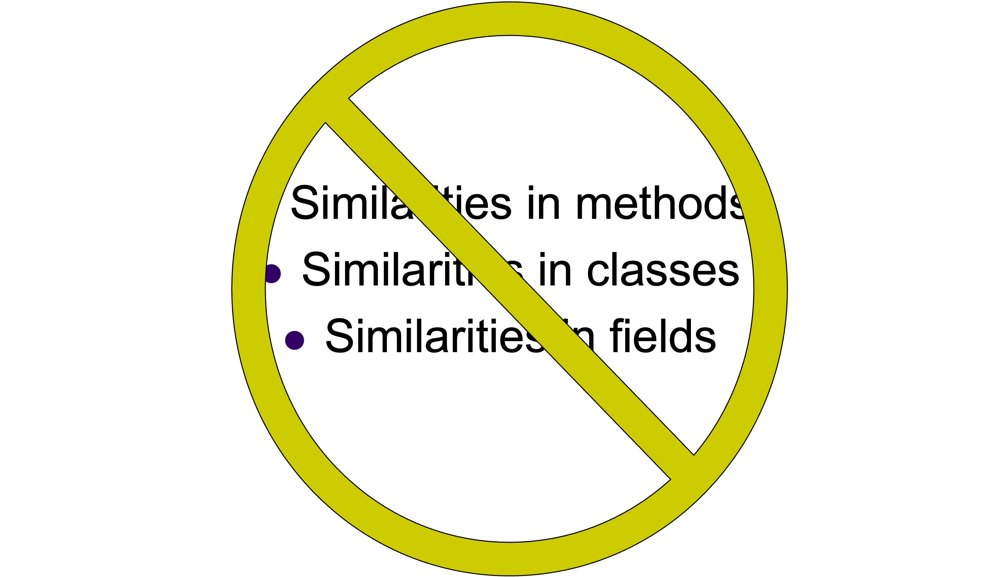
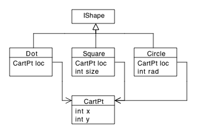
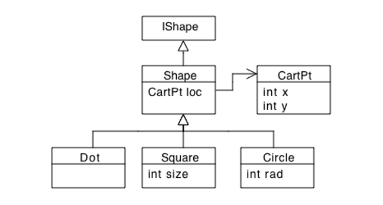

# Lecture 9 - Abstracting with Classes
CSC 121 - Object Oriented Program Design
Nadeem Abdul Hamid - Fall 2023

<!-- paginate: skip -->
<!-- _class: lead -->


---
## Objectives
<style scoped>ul  { font-size: 85%; line-height: 100%; }</style>

At the end of this lecture you should
- KNOW:
    - That `abstract` classes can be used to lift common fields and methods from class definitions
    - That you can't construct an instance of an `abstract` class
    - That subclasses that `extend` the abstract class inherit everything  defined in the abstract class
    - That a subclass can *override* a method defined in an abstract class

- BE ABLE TO:
    - Design and define an `abstract` class
    - Define and use a `super` constructor
    - Define a subclass that `extends` an abstract class
    - Define a subclass that *overrides* a method of the abstract class


<!-- paginate: true -->
<!-- footer: Lecture 9 - Abstracting with Classes -->


---
## Reading
<style scoped>ul  { font-size: 85%; line-height: 100%; }</style>

- Section 18 & 19
    - Shapes example
    - Recordings example

- Section 19 : Important Topics
    - Local variables, method composition
    - Abstracting similar methods in the same class
        - introduce a generalized version with extra parameter (like our drawComplex at the beginning of these slides)
    - Design recipe for abstracting across a union (creating abstract class, lifting shared methods)
    - Abstracting by creating a new union for independently-developed classes that are significantly similar
    - Deriving sub-classes from library classes (e.g. CartPt from Posn) – because you can’t change and recompile definitions that are given to you as part of a library
    - Creating subclasses for special objects


---
## Law* of Software Development

- **A program is never complete.**
    - There’s always room for revision, correction, improvement, reorganization, extension, … 


*I kind of made this up. But there are other famous "laws"! https://www.timsommer.be/famous-laws-of-software-development/ 


---




---
## What a mess!

```
    /** draw this mobile in a Canvas, hanging down from the given Posn */
    public PApplet draw(PApplet c, Posn p) {
        // account for torque
        if (this.torque() < 0) {   // leans to left
            c.line(p.x, p.y, p.x, p.y + this.length);
            c.line(p.x - this.leftSide, p.y + this.length + 3, p.x + this.rightSide, p.y + this.length - 3); 
            this.right.draw(c, new Posn(p.x + this.rightSide, p.y + this.length - 3));
            this.left.draw(c, new Posn(p.x - this.leftSide, p.y + this.length + 3));
            return c;
        } else if (this.torque() > 0) {
            c.line(p.x, p.y, p.x, p.y + this.length);
            c.line(p.x - this.leftSide, p.y + this.length - 3, p.x + this.rightSide, p.y + this.length + 3); 
            this.right.draw(c, new Posn(p.x + this.rightSide, p.y + this.length + 3));
            this.left.draw(c, new Posn(p.x - this.leftSide, p.y + this.length - 3));
            return c;
        } else {
            c.line(p.x, p.y, p.x, p.y + this.length);
            c.line(p.x - this.leftSide, p.y + this.length, p.x + this.rightSide, p.y + this.length); 
            this.right.draw(c, new Posn(p.x + this.rightSide, p.y + this.length));
            this.left.draw(c, new Posn(p.x - this.leftSide, p.y + this.length));
            return c;
        }        
    }
```

---
## Local Variables • Helper Methods

```
/** draw this mobile in a Canvas, hanging down from the given Posn */
    public PApplet draw(PApplet c, Posn p) {
        Posn pMid = p.translate(new Posn(0, this.length));
        Posn pLeft = p.translate(new Posn(-this.leftSide, this.length));
        Posn pRight = p.translate(new Posn(this.rightSide, this.length));
        
        if (this.torque() < 0) {  // leans to left
            return drawComplex(c, p, pMid, pLeft.translate(new Posn(0, +3)), pRight.translate(new Posn(0, -3)));
        } else if (this.torque() > 0) { // leans to right
            return drawComplex(c, p, pMid, pLeft.translate(new Posn(0, -3)), pRight.translate(new Posn(0, +3)));
        } else {
            return drawComplex(c, p, pMid, pLeft, pRight);
        }
    }

    PApplet drawComplex(PApplet c, Posn p, Posn pMid, Posn pLeft, Posn pRight) {
        c.line(p.x, p.y, pMid.x, pMid.y);
        c.line(pLeft.x, pLeft.y, pRight.x, pRight.y); 
        this.right.draw(c, pRight);
        this.left.draw(c, pLeft);
        return c;            
    }
```


---
## Similarities in Classes

- Similarities often arise in unions – especially field definitions in the variant classes
    - Sometimes variants also have identical or very similar method definitions




---
## Inheritance

- We want to say that all shapes share a particular field, though they represent different kinds of things
- In an OO language, classes can **inherit** from other classes (interfaces are a special case of that)
- `class A extends B { … ` says that *A inherits all of B’s features**
- `B` is the ***superclass***; `A` is the ***subclass***
    - Equivalently: *A refines B* or **A is derived from B**

* book has typos on page 229 – says all this backwards


---
## Shape Superclass

- Lift common fields, methods



(see lecture code/recording)

---
## Abstract Classes; Abstract Methods

- Since `Shape implements IShape`, it needs to provide method definitions – e.g. `area()`
    - But it doesn’t make sense to implement `area()` in `Shape` because its definition is different for particular shapes
    - **Conflict:** we need the method there; but can’t implement it
- Solution: Add an **abstract method** (just a signature like in an interface)
    - It also makes no sense to be able to create instances of Shape, so make the whole class `abstract`.


---
## Lifting Methods; Inheriting Methods

(Section 18.3)
- Identical method definitions can be lifted up to the superclass – subclasses all inherit the definition

- NOTE: After making such (major) changes to class hierarchies as discussed in these slides, always remember to re-run tests to ensure that you didn’t accidentally introduce a mistake


---
## Example (see also section 18.3)

- Lift the `largerThan` method to `AShape`
- Lift `distTo0` from `Dot` and `Square` to `AShape` 
    - ***Override*** its definition in `Circle`
- Use a `super` method call to clearly express the relationship between the `distTo0` method of the superclass and the `Circle` subclass
