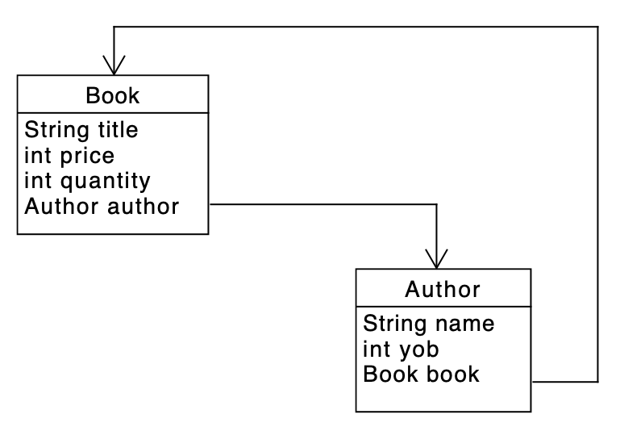

# Lecture 13 - Mutation
CSC 121 - Object Oriented Program Design
Nadeem Abdul Hamid - Fall 2024

<!-- paginate: skip -->
<!-- _class: lead -->


---
## Objectives
<style scoped>ul  { font-size: 90%; line-height: 100%; }</style>

At the end of this lecture you should
- KNOW:
    - That the assignment operator `=` *changes* the value of a field (*mutates* the object)
    - That the old value of the field is no longer accessible after being re-assigned by `=`
    - That `void` methods do not return a value, and multiple such methods cannot chained together (composed) in a single expression
    - When and where mutation is useful or harmful
    - How to test methods with side-effects


- BE ABLE TO:
    - Use mutation to create cyclical data.

<!-- paginate: true -->
<!-- footer: Lecture 13 - Mutation -->


---
## Books and Authors




---
## Author

```
/** Represents authors of books */
class Author {
    String name;
    int yob;
    Book book;

    Author(String name, int yob, Book bk) {
        this.name = name;
        this.yob = yob;
        this.book = bk;
    }
}
```

---
## Book
```
/** Represent books */
class Book {
    String title;
    int price;
    int quantity;
    Author author;

    Book(String title, int price, int quantity, Author ath) {
        this.title = title;
        this.price = price;
        this.quantity = quantity;
        this.author = ath;
    }
```


---
## Examples : Fail 1
```
    Author knuth = new Author("Donald Knuth", 1938,
            new Book("The Art of Computer Programming (volume 1)", 100, 2, ...));

    Book taocp = new Book("The Art of Computer Programming (volume 1)", 100, 2,
            new Author("Donald Knuth", 1938, ...));
```


---
## Examples : Fail 2
```
    Author knuth = new Author("Donald Knuth", 1938,
            new Book("The Art of Computer Programming (volume 1)", 100, 2, this.knuth));

    Book taocp = new Book("The Art of Computer Programming (volume 1)", 100, 2,
            new Author("Donald Knuth", 1938, this.taocp));
```


---
## Examples: OK but messy
```
    @Test
    void testBookAuthorCycle() {
        // Creates an Author whose book is **null**...
        Author knuth = new Author("Donald Knuth", 1938, null);
        
        // Creates a Book whose author is ok, but the author's book is still null...
        Book taocp = new Book("The Art of Computer Programming (volume 1)", 100, 2, knuth);
        
        // Now *change* the author's book field to be our newly created book...
        knuth.book = taocp;
        
        // These now pass!
        assertEquals( knuth, knuth.book.author );
        assertEquals( taocp, taocp.author.book );
    }
```


---
## New Concepts

- `null` : absence of data, can think of it as a "wildcard" value
    - variable of any class or interface type can be set to `null`
    - cannot invoke any methods on `null` values


- ***assignment statement***: *changes* the value of the field/variable on the left hand side of the equals symbol to the result of evaluating the expression on the right hand side
    - the right hand side is evaluated completely, before the left hand side gets modified and set to the result


---
## "Variables" and Assignment Statements

- Assignment statements are why we call variables *variables*. 
- Without assignment statements, variables never actually vary; they just remain fixed at whatever value they were initialized to be. 

- Assignment statements do not assert equality (`==``)
    - they *change the meaning* of the variable on the left hand side, for the rest of the program...
        - or at least until the next assignment to that same variable changes its meaning again


---
## Statements vs Expressions

- "Expression" :
    - (CSC120) a piece of code that evaluates (simplifies) to a value
    - can be *composed* to form bigger expressions, and these too evaluate to values

- "Statement" :
    - do *not* evaluate to values; they simply execute performing some special behavior indicated by the statement


---
## Java Statements (so far)

- `return e;` : exits a method and causes the method overall to evaluate to some `e` expression's value

- `if (blah) { ... } else { ... }` : means "if `blah` is true, then execute the first block of statements, otherwise execute the second block."

- *assignment* : change a variable to have a new value
    - Stands by itself on a line, like a return statement, ending with a semicolon.
    - You can only tell that the statement has run because of its *effect* on the rest of the program.


---
## Non-termination and cyclic data

```
Book taocp = new Book("The Art of Computer Programming (volume 1)", 100, 2, knuth);
Book taocp1 = new Book("The Art of Computer Programming (volume 1)", 100, 2, knuth);
```

Is `taocp` the same as `taocpa` ?

- (Does the generated `equals` get stuck in a loop?)


---
## Determinism 

- "Deterministic" methods/function : if we call/apply it twice (or more times) to the *same arguments* (inputs), we get the *same result* (output).
    
    ```
    (check-expect (f a1 a2 a3) (f a1 a2 a3))   ; Racket

    assertEquals( obj.meth(a1, a2, a3),  obj.meth(a1, a2, a3) ); // Java
    ```

What method does not pass these tests? 


---
## Non-determinism
<style scoped>ul  { font-size: 90%; line-height: 100%; }</style>

How does `Math.random` work?

- It must keep track of some information internally. Updates that information every time it's called. That is how it can produce different values despite not having any obvious inputs.

***Non-determinism***

- The ability to modify local state (e.g. by assigning to local variables or fields) means that methods may no longer be deterministic, and may not produce equal answers for equal inputs. In other words, they’re no longer "functions"! This means that our program behavior is no longer obviously predictable.


---
## Non-determinism and testing

```
class Counter {
    int val;
    
    Counter(int initialVal) {
        this.val = initialVal;
    }
    
    int get() {
        int ans = this.val;
        this.val = this.val + 1;
        return ans;
    }
}
```


---
```
class CounterTest {
    Counter c1 = new Counter(0);
    Counter c2 = new Counter(2);

	@Test
	void testOne() {
	    assertEquals(_, c1.get());
	    assertEquals(_, c1.get());
	    assertEquals(_, c1.get());
	    assertEquals(_, c1.get());
	}

    @Test
    void testTwo() {
        // What should these tests be?
        assertEquals(_, c1.get());                      // Test 1
        assertEquals(_, c2.get());                      // Test 2
        assertEquals(_, c1.get() == c1.get());          // Test 3
        assertEquals(_, c2.get() == c1.get());          // Test 4
        assertEquals(_, c2.get() == c1.get());          // Test 5
        assertEquals(_, c1.get() == c1.get());          // Test 6
        assertEquals(_, c2.get() == c1.get());          // Test 7
    }
}
```


---
## Discussion

Mutation & side-effects (assignment) have hazards. What are they good for, though?

- cyclic data structures
- interacting with the rest of the world (e.g. world library; hides an abstraction of mutation)
- (in the old days,) efficiency


So far, we only mutated object fields from the *examples/test* class. This is bad programming practice anyway; next... better approach for encapsulating assignment statements.

   